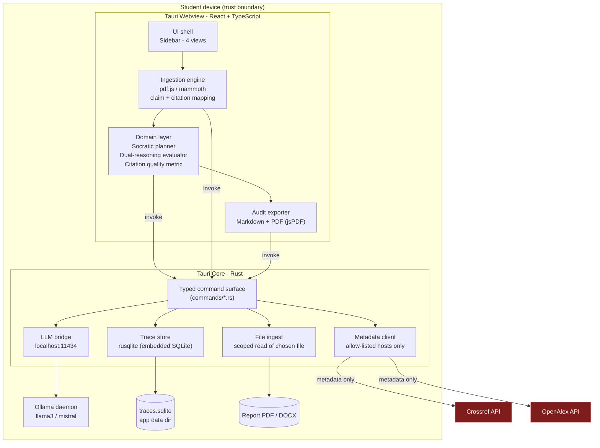
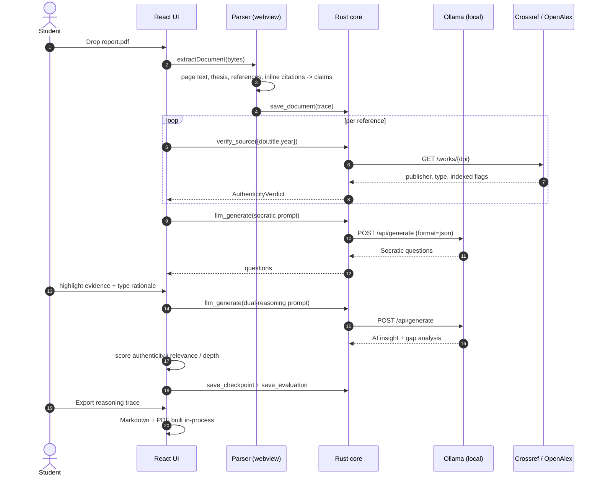
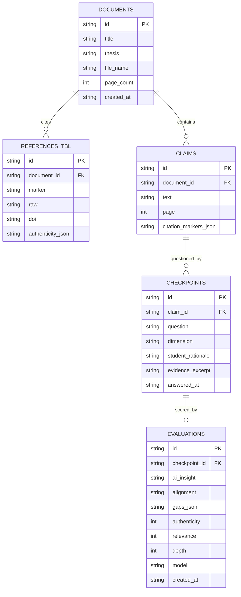

# Socratic Citation Coach - System Architecture

Local-first desktop application for SIT capstone students and faculty supervisors.
The guiding constraint is **zero third-party leakage of report text**: the full text
of a student report is parsed, reasoned over and stored entirely on the student's
machine. Only bibliographic identifiers (DOI, title, author surname, year) ever
leave the device, and only towards open scholarly APIs.

---

## 1. Layer diagram

Everything inside `Device` is local. The two red nodes are the only network
egress points, and the Rust metadata client is the only component allowed to
reach them (the webview CSP forbids remote connections altogether).

## 2. Pipeline

## 3. Module map

| Path | Responsibility |
| --- | --- |
| `src/types/index.ts` | Single source of truth for the domain model shared with Rust payload shapes. |
| `src/lib/env.ts` | Runtime detection of the Tauri host vs. plain browser (dev/demo mode). |
| `src/lib/ipc.ts` | Typed wrappers around `invoke`, with graceful degradation when the Rust core is absent. |
| `src/lib/parsing/extractText.ts` | PDF (pdf.js) and DOCX (mammoth) text extraction, page-aware. |
| `src/lib/parsing/references.ts` | Reference-list segmentation, DOI/venue/year extraction. |
| `src/lib/parsing/citations.ts` | Inline citation detection (`[12]`, `(Smith et al., 2023)`) and claim-sentence mapping. |
| `src/lib/parsing/index.ts` | Orchestrates ingestion into a `ReportDocument`. |
| `src/lib/ai/prompts.ts` | All LLM prompt templates (Socratic + dual reasoning). Auditable in one place. |
| `src/lib/ai/ollama.ts` | JSON-constrained local LLM calls with retry and schema coercion. |
| `src/lib/ai/socratic.ts` | Socratic question planning; deterministic fallback bank when no model is running. |
| `src/lib/ai/evaluator.ts` | AI-vs-student comparison, alignment classification, gap detection. |
| `src/lib/scoring.ts` | Authenticity / relevance / depth metric and citation health roll-up. |
| `src/lib/export/markdown.ts` | Reasoning Trace Log in Markdown. |
| `src/lib/export/pdf.ts` | Same log rendered to PDF via jsPDF. |
| `src/lib/persistence.ts` | Trace persistence: SQLite through Rust, `localStorage` in browser mode. |
| `src/state/AppStore.tsx` | Reducer-based application state and derived selectors. |
| `src/views/*` | The four sidebar destinations. |
| `src-tauri/src/commands/*` | `ingest`, `llm`, `metadata`, `traces` command modules. |
| `src-tauri/src/db.rs` | Schema + queries for the auditable trace store. |

## 4. Data model (SQLite)

## 5. Privacy controls, concretely

1. `tauri.conf.json` sets a CSP without remote `connect-src`, so the webview
   cannot reach the internet even if a dependency tried.
2. Network access lives only in `commands/metadata.rs`, which refuses any host
   outside `api.crossref.org` / `api.openalex.org` and only serialises the
   `SourceQuery` struct (DOI, title, first author, year).
3. `commands/llm.rs` refuses any base URL that is not loopback unless the
   operator explicitly configures an institutional endpoint, and records which
   endpoint produced each evaluation in the trace log.
4. Report bytes are read by Rust from a path the user picked, handed to the
   webview in memory, and persisted only inside the OS app-data directory.
